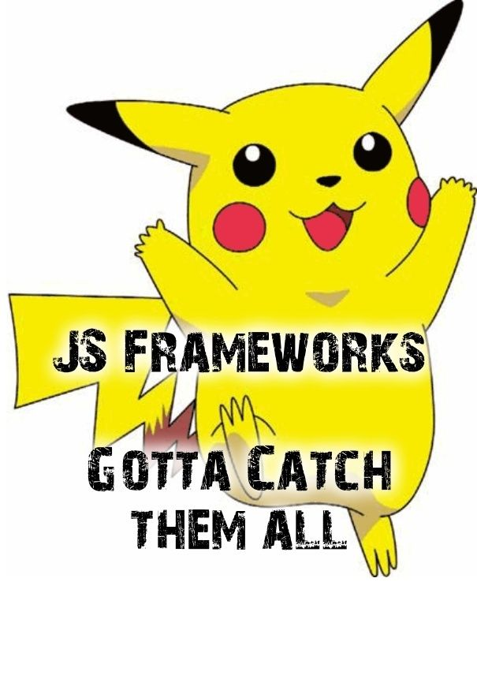
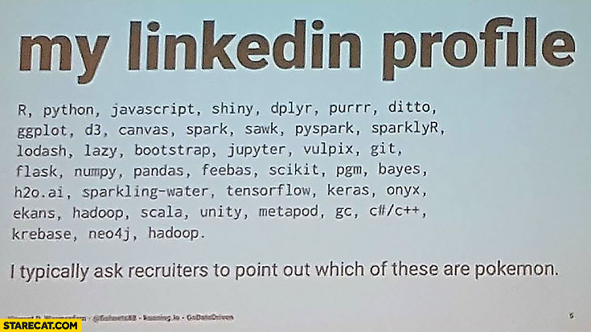

# HOMEWORK: PokéApp



Over the next two days, you will be building a Pokémon app in **React** using this super neat, super free [PokeApi](https://pokeapi.co/)!

## Here's your mockup:


## Here's your mission:

Build an app that renders the names of the first 151 Pokémon in the pokéapi database on page load. (Maybe this is `http://pokeapi.co/api/v2/pokemon?limit=151`... or something.... 🤔)  When the user clicks a name, the app should render information about that Pokémon, including the name and weight.

## Deliverables

1. Using all of your knowledge about wireframing and project planning, complete the following steps before jumping into a line of code:
  - Wireframe the mock up above, <a href="https://facebook.github.io/react/docs/thinking-in-react.html">React Docs style.</a>
  - No, really. [This is required reading.](https://facebook.github.io/react/docs/thinking-in-react.html)
  - Write user stories to match with the functionality. Put these in the `userstories.md` file in this repo.
  - Break down the user stories into steps to code.

2. Tackle app above with React. Make sure to write clean code, with **frequent git commits** (we should be able to view the story of building your app based on your commits).

3. Style that puppy and make it look goooooood. ([Need some inspiration?](http://designer-trails-71446.bitballoon.com/))

4. Submit hw via a pull request!

5. Deploy your amazing PokéApp!!
    - Run `npm build`
    - A new folder, `/build`, will appear
    - Take everything in the build folder and stick it up on BitBalloon!
    - Include your BitBalloon link on your pull request!

### React Tips

When loading initial data via an API call, place the API call in the component's `componentDidMount` method:

```javascript
class ExampleComponent extends Component {
  // probably state up here
  componentDidMount() {
    // api call here
  }

  render() {
    return (
      // a bunch of jsx...
    )
  }
```

### Bonus

Feeling like a rockstar? Add the Pokémon's abilities to the rendered profile (see mockup above).

### Note!

The PokéApi is rate limited:

> There is a daily rate limit of 300 requests per resource per IP address. So a single IP address can call the bulbasaur resource 300 times a day. Not 300 requests across the entire dataset! This is to stop our database from falling over under heavy load.

The limit is pretty high -- you shouldn't run out -- but if you do, either go to a nearby coffeeshop or use a [VPN](https://en.wikipedia.org/wiki/Virtual_private_network). ([TunnelBear](https://www.tunnelbear.com/) is a good one, and free for the first 600MB or so.)


## 🚀 Completion looks like:

- You have a PokéApp in this directory
- Your PokéApp has been styled and looks _killer_
- Your `userstories.md` has user stories in it
- Your PokéApp is deployed!

## 🚀 Your homework submission should include:

- A pull request created on _this repo_.
- Your BitBalloon link
- Completion, comfort, wins, losses, questions... you know the drill.

## This homework is due 🚨 11PM ON WEDNESDAY NIGHT 🚨



